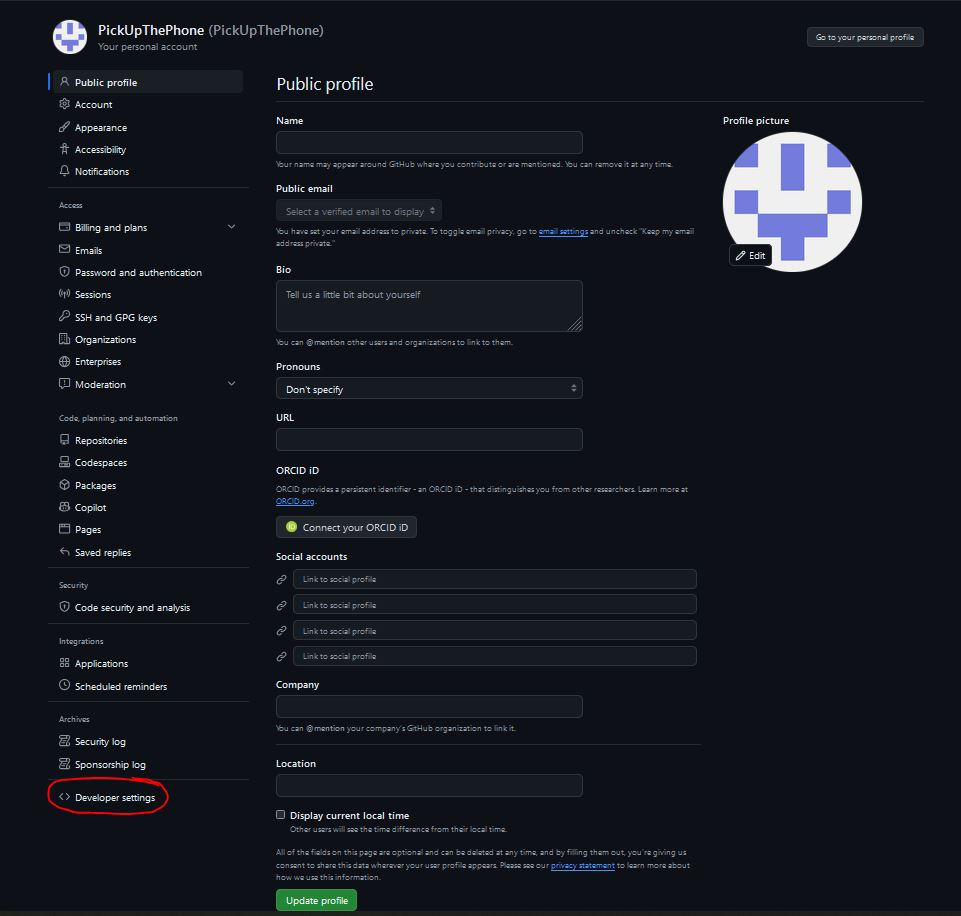
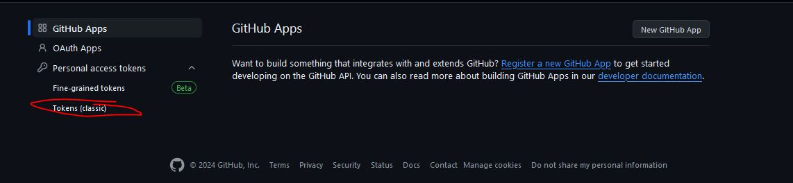
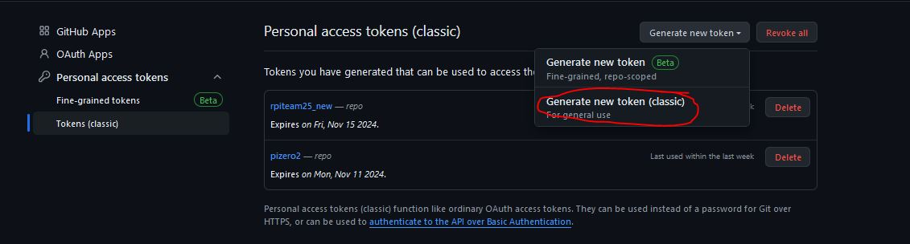
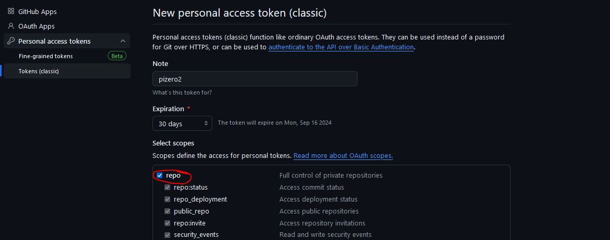

# pizero2

This guide will show you everything that you need know in order to develop in the raspberry pi environment. 

## How to SSH 
SSH allows you to connect to the pi command line interface (CLI) through your desktop. It is essential to know how to do this so that you can comunicate with and change files within the pi. 

Firstly, you need to connect your pi to the local network. Preferably one that has access to the internet. The simplest way you can do this is by connecting an ethernet cable directly to the router. 

Then, you must ensure that your desktop is connected to the same network. 

After that, you can SSH using the following command: 

`ssh user@host.local`

If you are using Will's Raspberry Pi 4, then 
- user: willm
- host: rpiteam25
- password: willm

If you are using my Raspberry Pi 4, then 
- user: user
- host: pi4
- password: password

The password prompt will appear after you run the command above. 

You will then get a prompt whether you trust the fingerprint. type yes. 

## Writing code for the pi on your desktop

Firstly, install git and github desktop  
- https://git-scm.com/downloads (git)
- https://desktop.github.com/download/ (git for desktop)

Then, accept my invitation to collaborate in this repo. It should appear in your email. Login using the desktop app. 

Open up any folder in your local machine. You will then need to clone the repository. This creates a local copy on your machine. To do so, either use the github for desktop GUI, or simply right-click in folder -> 'Open Git Bash here' 

 `git clone https://github.com/PickUpThePhone/pizero2`

If you want to activate the virtual environment on windows, first you must run the command below. Although there is not much point in activating the environment since some of the modules only work on linux (because they were installed in a linux environment). So preferably only run your code on the pi. 

`Set-ExecutionPolicy -ExecutionPolicy RemoteSigned -Scope Process`

## Basic Raspberry Pi OS commands

Raspberry Pi OS is Debian based, which means that the following commands will be applicable to most linux systems including Ubuntu. 

- `sudo <command>` - execute command with admin privilages
- `sudo apt update & sudo apt upgrade` - update the system (do it before you start working for the first time)
- `sudo apt install <package>` installs a desktop package (not for python)
- `cd <path>` - navigate to directory 
- `ls -la` - list all files in current directory 
- `cat <file>` - prints the text of a file to terminal
- `nano <file>` - text editor for files
- `rm -rf <file>` - remove specified file
- `rm -rd` <directory> - remove specified directory
- `mv <file> <destination-path>` - moves file. can also use to rename a file if the destination path is just the desired file name 
- `cp <file> <destination>` - copies file to destination 

To get additional help on commands, usually the following works 

`<command> --help`

To get extremely detailed help: 

`man <command>`

And of course look online and ask ChatGPT about commands and how to do things. 

## Setting up GitHub on the pi

Install git on the pi if it is not already there   

`sudo apt install git`

Then clone the repository into the home folder

`cd /home/user`

`git clone https://github.com/PickUpThePhone/pizero2`

Then you will need to set up a Personal Access Token (PAT). This will function as your GitHub password when you enter your login credentials on the rpi. 

## Running the setup script

If you have followed this guide in chronological order, then you are ready to run the setup script. Otherwise, go back to the setting up Git step to get your personal access token and clone this repo. 

Navigate to script directory 

`cd pizero2`

Run the script

`./setup.sh`

If you encounter any errors, you can read the script using `cat setup.sh` and see what it is doing. You can then copy the steps manually. 

Note that if you run the set up script and it finishes successfully you can skip the environment creation in the next section. 

## Setting up the pi environment

Set up needs to be done locally on every machine that you choose to run your code. The environment folder is ignored when pushing to git because there is too much bloat. 

Install the dependencies 

`sudo apt install libcamera-dev libcap-dev`

Then create the virtual environment 

`cd <path>/pizero2`

`python -m venv .venv`

Activate the environment 

`source .venv/bin/activate`

You should see something like this on your command line

`(.venv) user@pi4:~/pizero2/.venv/bin$` 

Install the requirements.txt file to fill your virtual environment 

`pip install -r requirements.txt`

## Running code on the pi 

First make sure the virtual environment is activated. Then navigate to the folder where your script is located. 

`cd <script-path>`

Run the script

``python example.py``

## Installing additional packages 

Activate the virtual environment before installing any new packages. Then use:

`pip install <package>`. 

## Using SCP to copy files via SSH 

SCP (Secure Copy) uses the SSH protocol to securely transfer files. It can allow you to copy files between machines without the use of git. 

**Copy from computer to rpi**   

`scp "C:\Users\ryan\Desktop\files.zip" user@pizero2.local:/home/user` 

Copies 'files.zip' into the rpi home directory 

**Copy from rpi to computer**  

`scp user@pizero2.local:/home/user/files.zip "C:\Users\ryan\Desktop"`

Copies 'files.zip' into the local machine desktop. 

Adjust the file paths accordingly. 

## Using GitHub for version control 

If you haven't used git before, you should probably watch a 5 minute animation on youtube first as it is going to be extremely confusing otherwise. I will explain briefly the most basic functions

### Add the remote files onto your local machine

- **clone** - saves a copy of the repo to your local machine (you only do this once at the start)
- **pull** - gets the latest changes to the repo from github 

### Add your local files to the remote repository 

-  **add** - adds any recent local changes to the stage. This basically just means that git can now see the changes you made to the files. 
- **commit** - Prepares your staged changes before you upload. Allows you to include a nice message that can explain the changes you made. 
- **push** - Pushes (uploads) the changes to the remote repository.

Typical workflow is add -> commit -> push

### Other
- **stash** stashes away (and hides) all the local changes that you made. 
- **stash pop** brings back the local changes. These two commands are good if you want to put aside your local changes, pull the remote repo, and add your changes on top. 

--- 

## Troubleshooting 

### Error when cloning-> 'fetch-pack: unexpected disconnect while reading sideband packet'

---

Run the following command and then try again 

`git config --global http.version HTTP/1.1` 

Switch back to HTTP/2.0 afterwards

`git config --global http.version HTTP/2.0`

---

### Cannot SSH 

---

Three possibilities 

***Host name not recognised*** 

On your pi, run the following command and take note of the ip address

`ip address`

Then SSH as usual but instead using the local IP address you found 

`ssh user@192.168.0.50`

***Network interface down*** 

wlan0 will be red if the interface is down. If you are connecting with ethernet, the interface will be eth0. 

`nmcli d status`

Bring the interface up using 

`nmcli d connect wlan0`

***Automatically connected to wrong network on boot*** 

List conencted network 

`nmcli c show`

The SSID of the connected network will be in the NAME column. If you are connected to the wrong network: 

`nmcli up SSID`. 

if you desired network doesn't show up, it means you haven't configured it yet. Run the network GUI and set it up. 

`nmtui` 

Edit a connection -> Add -> Wi-Fi 

- SSID: Network Name 
- Security: WPA & WPA2 Personal 
- Password: Network Password 

Leave the rest as defaults and hit Ok. 

Then run `nmcli up SSID` again. Or use the network GUI to activate the connection. 

---

### OpenCV cv2.VideoCapture(0) not working 

---

Upgrade opencv. A couple of depencies will also pop up at some point. I forgot what they were, but just `sudo apt install` them if you see the message. 

`pip install --upgrade opencv-python-headless` 

